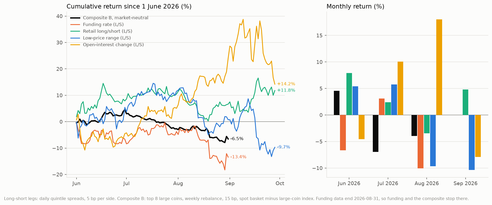

# Equity Microstructure Factors in Crypto: Funding Rates and Positioning

**Question.** Do the factors of a sell-side market-microstructure series written for
China A-shares (Kaiyuan Securities, *Market Microstructure Research*, reports 1–32) carry
over to crypto, where minute bars, taker-side order flow and perpetual-futures data are
free?

**Answer, in one line.** The data wall disappears, but most factors do not travel. The
signals that held up are the ones A-shares do not have — the perpetual **funding rate**
and **retail positioning** — plus a low-price **range** factor, and they pay only in a
market-neutral form (spot long basket, perpetual index short). After publication the
combination returned +4.6% in June 2026, −6.9% in July and −4.0% in August (−6.5% over
the three months), so it has not made money out of sample so far.

Evidence grade: **backtest and out-of-sample backtest** (association). Nothing here is
live trading or investment advice.

## Data

| Item | Source |
|---|---|
| Spot and USDT-margined perpetual 1-minute klines, including taker-buy volume | Binance public dumps, `data.binance.vision` |
| Funding rates (monthly files), open interest and long/short ratios (daily) | `data.binance.vision` |
| Cross-exchange check: daily OHLCV and funding | OKX via `ccxt` |
| Panel | 105 coins × 730 days, 2024-06 to 2026-05 (extended to 851 days, through 2026-09-29, in the updates) |

Raw data are not in this repository; `binance_pipeline.py`, `perp_pipeline.py`,
`fetch_okx.py` and `update_data.py` download them.

**Backtest conventions.** Daily cross-sectional quintile long–short, 5 bp per side; about
five names per leg in the large-coin pool; 365-day annualization. Robustness checks:
two-halves split, parameter sensitivity, rolling windows and the OKX cross-exchange
replication.

## Results (report of 2026-06-19, data through 2026-05-31)

| Factor | Type | 730-day Sharpe | Out-of-sample checks | Verdict |
|---|---|---|---|---|
| Funding rate | perpetual | +1.42 | both halves positive; parameter-stable; 91% of rolling windows positive; same sign on OKX | strongest |
| Retail long/short ratio | perpetual | +1.39 | both halves positive; parameter-stable | robust |
| Low-price range | price | +1.63 | both halves positive; most parameter-stable; same sign on OKX | robust (bear-market defensive) |
| Large taker buys | order flow | +0.73 | both halves positive, parameter-fragile | low confidence |
| "Ideal" reversal | price | +0.25 | both halves positive, parameter-fragile | low confidence |
| Cross-sectional momentum | price | −0.38 | both halves negative | does not transfer |

Other findings recorded in [`REPORT.md`](REPORT.md):

- **Short samples manufacture factors.** The best factors on a 120-day window
  (Sharpe +3.50 and +1.93) turned negative on 730 days.
- **Each factor has its own best universe breadth**; taker-flow factors are unstable
  across pools (Sharpe 0.73 / 0.10 / 1.62), funding is strong in all three.
- **Fade the "top traders".** Following Binance's top-trader long/short ratio loses
  (Sharpe −1.36).
- **Constrained optimization helps by dropping bad factors, not by fine weighting**:
  with only good factors, 1/N beats mean–variance; with bad ones mixed in, constrained
  max-Sharpe wins by setting them to zero (Sharpe 0.39 → 0.89).
- **83% of the funding factor's return is price reversal and 17% carry.**

**Deliverable composite** (`deploy_spot.py`): z-score of funding + retail ratio + range,
top 8 large coins, equal weight, weekly rebalance.

| Form | NAV | Sharpe | Max drawdown | Weekly turnover |
|---|---|---|---|---|
| Spot long only | 0.59 | −0.54 | −56% | 5% |
| Spot long + perpetual index short (market-neutral) | 1.35 | +1.18 | −11% | 5% |

## After publication

The factors are cross-sectional ranks with no fitted parameters, so every day after
2026-05-31 is out of sample.

| Update | Window | Market-neutral composite | What changed |
|---|---|---|---|
| [`UPDATE_2026-07.md`](UPDATE_2026-07.md) | June 2026 (30 days) | **+4.6%**, max drawdown −2.0% | Funding reversed in the June sell-off (new-window Sharpe −1.76; its short leg failed); retail ratio and range strengthened |
| [`UPDATE_2026-08.md`](UPDATE_2026-08.md) | July 2026 (31 days) | **−6.9%**, max drawdown −5.6% | Range and retail ratio turned negative; open-interest change became the strongest factor year to date |
| [`UPDATE_2026-09.md`](UPDATE_2026-09.md) | August 2026 (31 days); single factors through 2026-09-28 | **−4.0%** | Altcoins rallied (+21% in August, +35% in September); funding's short leg failed again (−10.1% in August); range lost in both months |



Over June–August (92 days) the composite returned **−6.5%** with a maximum drawdown of
−11.9%, slightly deeper than the −11.5% of its whole pre-publication backtest (515 days).
Of its three components, only the retail ratio is positive since publication (+11.8%
long–short through September); funding is −13.4%, almost all of it from the short leg
(its long leg alone is +5.7%), and range is −9.7%. September's funding file is published
in early October, so the composite stops at 2026-08-31. The recipe has not been re-fitted:
re-weighting on four months of data would be fitting to noise.

A data note: Binance's QNT and SAGA perpetuals made one-sided moves in late September
(QNT closed at about 5× its OKX price), so September figures for the broad-universe
factors are unreliable; the large-coin factors and the composite do not include these
coins. Major-coin closes match OKX within 0.04%.

One to four months of data say little about Sharpe ratios; the updates report cumulative
returns and day counts instead.

## Limitations

- Fills at the next close, no market impact, equal weights within quintiles, about five
  names per leg in the large-coin pool.
- The 2024–26 sample is an altcoin bear market; part of the range factor's Sharpe is
  bear-market defence.
- OKX funding history via `ccxt` reaches back only about three months, so the
  cross-exchange check is short.
- Capturing the funding factor requires perpetual shorts (margin, liquidation, funding
  accrual).

## Reproduce

```bash
pip install ccxt pandas pyarrow scipy matplotlib
python binance_pipeline.py      # spot dumps
python perp_pipeline.py all     # perpetuals, funding, open interest
python backtest_perp.py         # factor backtests by universe breadth
python backtest_real.py         # funding accrual, long-only and decomposition
python oos_validate.py          # split-sample, parameter and rolling checks
python oos_okx.py               # OKX cross-exchange check
python deploy_spot.py           # deliverable composite
python update_data.py all && python report_postpub.py   # post-publication windows and months
python make_charts_postpub.py                           # equity_postpub.png
```

`live_monitor.py` serves a local dashboard (`dashboard.html`, preview in
`dashboard_preview.png`) that marks the composite to OKX prices.

## Files

The research write-ups are in Chinese: [`README_zh.md`](README_zh.md) (full detail),
[`REPORT.md`](REPORT.md), [`UPDATE_2026-07.md`](UPDATE_2026-07.md),
[`UPDATE_2026-08.md`](UPDATE_2026-08.md) and [`UPDATE_2026-09.md`](UPDATE_2026-09.md). Result tables are in the CSV files at the top
level; figures are the PNG files.

Research period: June–September 2026. Source series: Kaiyuan Securities (开源证券)
financial-engineering *Market Microstructure Research* series; the reports themselves
are not redistributed here.
